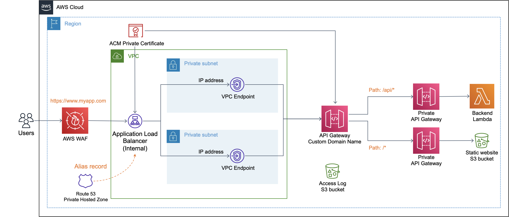

# Private Application with Custom Domain Name

This solution deploys an application in private AWS network with custom domain name using an AWS CloudFormation template. Web contents and APIs are restricted to internal network where users could only be accessed from specific private subnets without internet access, such as through AWS Direct Connect, AWS Site-to-Site VPN, AWS Client VPN or AWS WorkSpaces. No internet network traffic and no internet gateway is needed. The web application uses HTTPS in a custom domain and all network traffic is encrypted in transit. This solution is scalable and highly available. All components are AWS managed services and there are no EC2 instances to manage.

## Architecture

A web application consists of backend and frontend. The backend REST APIs are implemented in Lambda function while the frontend static web pages are hosted in S3 bucket. Both types of requests are routed by private API Gateways in custom domain name. As private API Gateway does not support custom domain name, requests first reach an Application Load Balancer and then forward to API Gateway through VPC endpoint by its IP addresses in multiple availability zones. To further protect from common web exploits, the web application sits behind an AWS Web Applcation Firewall (WAF).

## Deployment

### Prerequisites

Before the solution is deployed, prepare the followings in your AWS account.

- Decide a private domain name for web application.
- Create a VPC with two or more private subnets in different availability zones.
- Create a private hosted zone in Amazon Route 53. Its domain name has to match with the web application domain. The VPC in last point has to associate with the hosted zone.
- Request or import a SSL certificate for your web application domain in AWS Certificate Manager (ACM). You can request a certificate in ACM if you have an ACM private Certificate Authority (CA). Otherwise you can import a certificate to ACM generated by your own CA.
- Create a S3 bucket for storing the deployment assets for AWS CloudFormation.

### Steps

You could use a deployment script [deploy.sh]() to deploy automatically. To run `deploy.sh`, setup your development environment in Linux, macOS or [AWS Cloud9](https://docs.aws.amazon.com/cloud9/latest/user-guide/create-environment.html). Make sure [AWS CLI](https://docs.aws.amazon.com/cli/latest/userguide/install-cliv2.html) and [jq](https://stedolan.github.io/jq/download/) are installed.

Next, do the followings to deploy the architecture using AWS CloudFormation.

1. Modify the `deploy.sh`, replace the parameters of **REPLACE_ME** with the ones for your environments.

   | Variable Name    | Meaning                                                      | Example                                                      |
   | ---------------- | ------------------------------------------------------------ | ------------------------------------------------------------ |
   | DeploymentBucket | Existing S3 Bucket where deployment assets for CloudFormation will be uploaded to | cloudformation-assets-3edf21fa                               |
   | StackName        | CloudFormation stack name                                    | PrivateWebApp                                                |
   | BucketNamePrefix | Prefix of S3 buckets name generated                          | privatewebapp                                                |
   | DomainName       | Domain name for application (without https://)               | www.myapp.com                                                |
   | HostedZoneID     | Amazon Route 53 private hosted zone ID                       | Z08709521TMXDIJCU47RG                                        |
   | SSLCertID        | The ARN of the SSL certificate to be used                    | 4e39d0d2-4c54-4dd5-9de4-bcc1d80428c8                         |
   | VpcID            | VPC ID of the VPC where you are accessing the application    | vpc-aaae5bc5                                                 |
   | SubnetIDs        | Two or more subnet IDs where you want to access the application from | subnet-075343772d89dce5e,subnet-022a8e66561d731cc,subnet-011408576543bfac0 |
   | IngressCidr      | CIDR address range allowed to access the application         | 172.31.0.0/16                                                |

2. Run the script `deploy.sh`.

You will find all the resources created on the [AWS CloudFormation console](https://console.aws.amazon.com/cloudformation/home?#/stacks/).

When the script completes you could browse a sample web application hosted in your domain name. Don't forget you have to access this web application within your VPC.

### Clean Up

Delete the CloudFormation stack on AWS console. The default stack name is **PrivateWebApp**. Also, there are two Amazon S3 buckets retained with names beginning with **privatewebapp**. You can delete them manually.

## Security

See [CONTRIBUTING](CONTRIBUTING.md#security-issue-notifications) for more information.

## License

This library is licensed under the MIT-0 License. See the LICENSE file.
